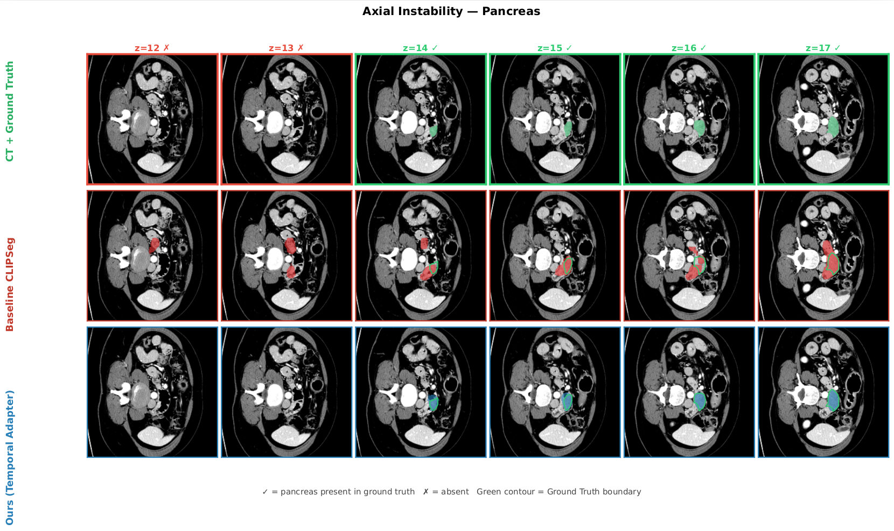
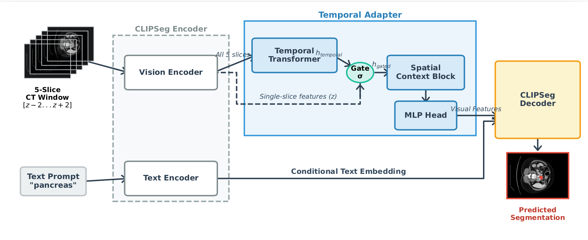
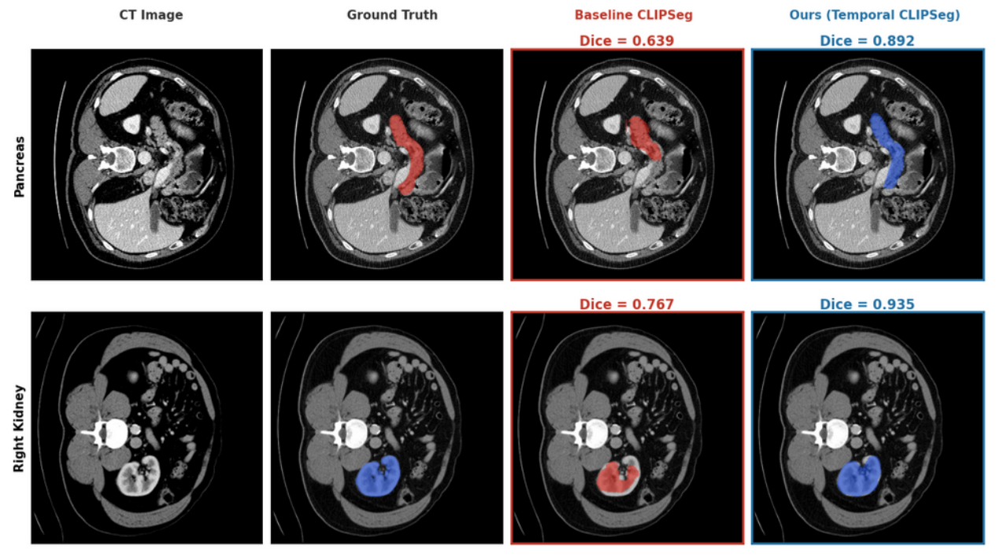

<h1 align="center">T-Gated Adapter: A Lightweight Temporal Adapter for Vision-Language Medical Segmentation</h1>

<!-- <p align="center">
  CVPRW PHAROS-AIF-MIH
</p> -->

<p align="center">
  <b><font size="3">CVPRW 2026 PHAROS-AIF-MIH</font></b>
</p>

<p align="center">
  <a href="https://arxiv.org/abs/2604.08167" target="_blank">
    
  </a>
  <a href="#citation">
    
  </a>
</p>

<!-- <a href="https://arxiv.org/abs/2602.20423" target="_blank"></a>

<a href="#citation"></a> -->

<!-- <p align="center">
  <b><font size="3">
    <a href="https://pharos-workshop.github.io/">CVPRW PHAROS-AIF-MIH</a>
    &nbsp;&nbsp;&nbsp;•&nbsp;&nbsp;&nbsp;
    <a href="https://arxiv.org/abs/2604.08167">arXiv</a>
  </font></b>
</p> -->

<!-- <p align="center">
  <a href="paper/T_Gated_Adapter.pdf">Paper</a>
</p> -->

## Overview

<!-- <p align="center">
  
  <em>Temporal inconsistency of slice-wise VLM inference on the pancreas. Green slice labels indicate the organ is present in ground truth. The baseline (middle row) produces spurious detections in anatomically implausible slices. Our method (bottom row) remains consistent, suppressing predictions where the pancreas is absent.</em>
</p> -->


**Abstract**: *Medical image segmentation traditionally relies on fully supervised 3D architectures that demand a large amount of dense, voxel-level annotations from clinical experts which is a prohibitively expensive process. Vision Language Models (VLMs) offer a powerful alternative by leveraging broad visual semantic representations learned from billions of images. However, when applied independently to 2D slices of a 3D scan, these models often produce noisy and anatomically implausible segmentations that violate the inherent continuity of anatomical structures. We propose a temporal adapter that addresses this by injecting adjacent-slice context directly into the model’s visual token representations. The adapter comprises a temporal transformer attending
across a fixed context window at the token level, a spatial context block refining within-slice representations, and an adaptive gate balancing temporal and single-slice features. Training on 30 labeled volumes from the FLARE22 dataset, our method achieves a mean Dice of 0.704 across 13 ab-
dominal organs with a gain of +0.206 over the baseline VLM trained with no temporal context. Zero-shot evaluation on BTCV and AMOS22 datasets yields consistent improvements of +0.210 and +0.230, with the average cross-domain performance drop reducing from 38.0% to 24.9%. Furthermore, in a cross-modality evaluation on AMOS22 MRI with neither model receiving any MRI supervision,
our method achieves a mean Dice of 0.366, outperforming a fully supervised 3D baseline (DynUNet, 0.224) trained exclusively on CT, suggesting that CLIP’s visual semantic representations generalize more gracefully across imaging modalities than convolutional features.*

## Method

<p align="center">
  
    <em>Overview of the proposed temporal adapter. Novel components include temporal transformer, spatial context block, and adaptive gate which are highlighted in blue and green within the Temporal Adapter module.</em>
</p>

1. **Temporal transformer**: A stack of transformer encoder layers that applies self-attention across the 5-slice context window at each spatial token position independently. It enables the model to aggregate anatomical evidence along the axial dimension, allowing the center slice to verify its predictions based on the presence of supporting structures in neighboring slices.

2. **Spatial context block**: A self-attention module designed to refine the temporally-enriched tokens by modeling the global spatial relationships within the center slice. This block ensures that the final representations are not only volumetrically informed but also spatially coherent, resolving any inconsistencies introduced during the temporal fusion process before the features reach the decoder.

3. **Adaptive gate**: A learnable gating mechanism that dynamically calculates a scalar weight to balance the contribution of the new temporal context with the original 2D CLIP representations. By initializing this gate to favor the single-slice baseline, the model learns to conservatively incorporate volumetric information only when it is necessary to resolve spatial ambiguities or suppress noise.


## Results

### 1. Main Performance Comparison (Mean Dice)
Comparison of the CLIPSeg baseline versus our proposed temporal adapter across multiple CT benchmarks.

| Method | FLARE22 (Test) | BTCV (Zero-shot) | AMOS22 CT (Zero-shot) |
| :--- | :---: | :---: | :---: |
| CLIPSeg Baseline  | 0.497 | 0.334 | 0.283 |
| **T-Gated Adapter (Ours)** | **0.704** | **0.544** | **0.513** |
| *Absolute Improvement* | *+0.207* | *+0.210* | *+0.230* |

### 2. Zero-Shot Cross-Modality Generalization (CT $\rightarrow$ MRI)
Zero-shot evaluated on the AMOS22 MRI subset without neither model receiving any mri supervision.

| Method |  AMOS22 MRI (Zero-shot) |
| :--- | :---: |
| DynUNet   |  0.224 |
| **T-Gated Adapter (Ours)** | **0.366** |

### 3. Per-Organ Analysis (FLARE22)

| Organ | Baseline | + Temporal | $\Delta$ Dice |
| :--- | :---: | :---: | :---: |
| Pancreas | 0.243 | 0.647 | **+0.404** |
| Stomach | 0.581 | 0.849 | **+0.268** |
| Gallbladder | 0.442 | 0.715 | **+0.273** |
| R. Kidney | 0.499 | 0.836 | **+0.337** |
| **Mean** | **0.497** | **0.704** | **+0.207** |

<p align="center">
  
  <em>Qualitative segmentation comparison on the best-performing slice per organ. Dice scores are shown above each prediction column.</em>
</p>

## Installation

```bash
git clone https://github.com/pranzalkhadka/T-Gated-Adapter.git
cd T-Gated-Adapter
python3 -m venv venv
source venv/bin/activate
pip install -r requirements.txt
```

## Data Preparation

```bash
python scripts/prepare_flare_data.py \
  --img-path /path/to/3d/images \
  --lbl-path /path/to/3d/labels \
  --out-root /path/to/output_2d
```

## Training

```bash
# 3D DynUNet
python scripts/train_dyunet.py \
  --img-path /path/to/3d/images \
  --lbl-path /path/to/3d/labels

# 2D CLIPSeg baseline
python scripts/train_clipseg_baseline.py \
  --train-manifest /path/to/train_labeled/manifest.jsonl \
  --val-manifest /path/to/val_labeled/manifest.jsonl

# 2D CLIPSeg temporal
python scripts/train_clipseg_temporal.py \
  --train-manifest /path/to/train_labeled/manifest.jsonl \
  --val-manifest /path/to/val_labeled/manifest.jsonl
```

## Citation

If you find this work useful, please cite:

```bibtex
@article{khadka2026tgated,
  title={T-Gated Adapter: A Lightweight Temporal Adapter for Vision-Language Medical Segmentation},
  author={Khadka, Pranjal},
  journal={arXiv preprint arXiv:2604.08167},
  year={2026},
  note={Accepted at the PHAROS-AIF-MIH Workshop at CVPR 2026}
}
```

## Acknowledgements

We are grateful to the authors of the following repositories and datasets for making their work publicly available:

1. [Contrastive Language-Image Pretraining (CLIP)](https://github.com/openai/CLIP)  
2. [Image Segmentation Using Text and Image Prompts (CLIPSeg)](https://github.com/timojl/clipseg)   
3. [Fast and Low-resource semi-supervised Abdominal Organ Segmentation in CT (FLARE22)](https://flare22.grand-challenge.org/) 
4. [Multi-Atlas Labeling Beyond the Cranial Vault - Workshop and Challenge (BTCV)](https://www.synapse.org/#!Synapse:syn3193805/wiki/217789)
5. [Multi-Modality Abdominal Multi-Organ Segmentation Challenge 2022 (AMOS22)](https://amos22.grand-challenge.org/)
